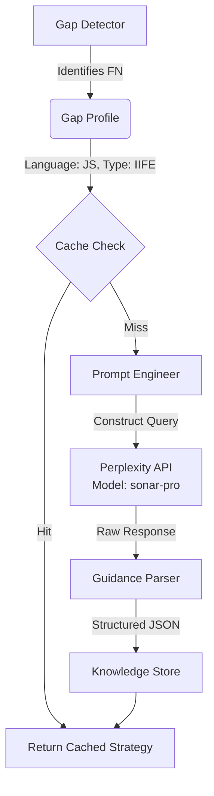

# CCI Validation & Precision Context Fetcher Architecture

**Date:** 2026-01-23 11:26:16
**Model:** gemini-3-pro-preview
**Task:** Validate CODOME_COMPLETENESS_INDEX.md spec + Design Perplexity API integration
**Cost:** $0.4046 (186,188 input + 2,688 output tokens)

---

## Query

Review the CODOME_COMPLETENESS_INDEX.md spec at standard-model-of-code/docs/specs/CODOME_COMPLETENESS_INDEX.md.

TASKS:
1. Validate the architecture - is CCI = Sensitivity × Specificity the right formula? Should we use F1 instead? What about weighted versions?

2. Challenge: Design a PRECISION CONTEXT FETCHING system using Perplexity API SONAR-PRO model. The goal is to fetch pinpoint external knowledge (documentation, best practices, edge cases) when our CCI attribution reveals OUR_FAULT gaps.

---

## Part 1: CCI Formula Validation

### Original Formula Critique

**Current Formula:** `CCI = Sensitivity × Specificity`

#### Issues Identified

1. **The "Zero" Penalty:** If either metric is 0, the score is 0. Good for strictness but bad for progress tracking.
2. **The Specificity Trap:** In code analysis, True Negatives are conceptually infinite (whitespace, comments, other atoms). Specificity becomes artificially high.
3. **Multiplication vs. Harmonic Mean:** Multiplication implies the metrics are independent probabilities.

### Recommendation: F2 Score

**Formula:**
```
F₂ = (1 + 2²) · (Precision × Recall) / ((2² · Precision) + Recall)
F₂ = 5 · (Precision × Recall) / ((4 · Precision) + Recall)
```

**Why F2 over F1?**
- F2 weighs **Recall (Sensitivity)** higher than Precision
- For "Completeness," we want to find ALL atoms first, then filter noise later
- F2 penalizes missing an IIFE pattern (False Negative) more than misclassifying a comment (False Positive)

**Alternative: G-Mean**
```
G-Mean = √(Sensitivity × Specificity)
```
Dampens the volatility of raw multiplication.

### Updated CCI Formula

```
CCI_F2 = F2_SCORE × 100

CCI_GMEAN = √(Sensitivity × Specificity) × 100  (Alternative)

Interpretation:
  CCI >= 95%  → EXCELLENT (production ready)
  CCI 85-94%  → GOOD (minor gaps)
  CCI 70-84%  → FAIR (needs tuning)
  CCI < 70%   → POOR (significant blind spots)
```

---

## Part 2: Precision Context Fetching Architecture

### System Design



### Data Models

```python
@dataclass
class GapProfile:
    """Defines the specific 'Our Fault' gap detected by CCI."""
    language: str
    missing_atom: str  # e.g., "LOG.MOD.IIFE"
    context_snippet: str
    error_type: Literal["MISSING_DETECTION", "MISCLASSIFICATION", "BOUNDARY_ERROR"]
    file_path: Optional[str] = None
    start_line: Optional[int] = None

@dataclass
class ActionableGuidance:
    """Structured knowledge returned by Sonar-Pro."""
    pattern_name: str
    detection_regex: Optional[str]
    tree_sitter_query: Optional[str]
    edge_cases: List[str]
    implementation_tips: str
    confidence: float

@dataclass
class ResearchResult:
    gap_id: str
    timestamp: float
    guidance: ActionableGuidance
    source_urls: List[str]
```

### System Prompt

```
You are a Senior Compiler Engineer and AST Expert specializing in code pattern detection.
Your goal is to provide concrete, implementable details for detecting code patterns.

CONTEXT: The user has a code analysis tool that failed to detect a specific pattern.
They need precise guidance on how to fix their parser/extractor.

OUTPUT FORMAT:
Return ONLY valid JSON matching this exact schema:
{
    "pattern_name": "The standard/canonical name of this pattern",
    "detection_regex": "A Python-safe regex (or null)",
    "tree_sitter_query": "The S-expression query (or null)",
    "edge_cases": ["List of 3-5 common failure modes"],
    "implementation_tips": "Concrete advice",
    "confidence": 0.0 to 1.0
}
```

### User Prompt Template

```
TASK: We failed to detect a '{missing_atom}' pattern in {language} code.

ERROR TYPE: {error_type}
FILE: {file_path} (line {start_line})

CODE SNIPPET THAT WAS MISSED:
```{language}
{context_snippet}
```

REQUIREMENTS:
1. Identify the specific syntax pattern shown in the snippet.
2. Provide the Tree-sitter S-expression query to capture this node type.
3. Provide a fallback regex for when AST parsing fails.
4. List edge cases where this pattern might be confused with similar constructs.
5. Explain the key AST node types involved.
```

### Core Engine Features

1. **Caching:** SHA-256 hash of `language:atom:error_type` → JSON file in `.agent/intelligence/external_cache/`
2. **TTL:** Configurable (default 168 hours = 1 week)
3. **Budget Control:** Token-bucket style monthly budget tracking
4. **Rate Limiting:** Exponential backoff on 5xx errors
5. **Retry Logic:** Max 3 retries with backoff
6. **JSON Extraction:** Handles markdown code blocks in responses

### Configuration

**Location:** `context-management/config/aci_config.yaml`

```yaml
research:
  model: "sonar-pro"
  max_monthly_budget_usd: 5.00
  cache_ttl_hours: 168  # 1 week
  timeout_seconds: 60
  temperature: 0.1  # Low for factual precision
  max_retries: 3
```

### Example Usage

```python
from precision_fetcher import PrecisionContextFetcher, GapProfile

fetcher = PrecisionContextFetcher()

# Example: We missed a JavaScript IIFE
gap = GapProfile(
    language="javascript",
    missing_atom="LOG.MOD.IIFE",
    context_snippet="(function() { console.log('I am hidden'); })();",
    error_type="MISSING_DETECTION"
)

result = await fetcher.resolve_gap(gap)
print(f"Pattern: {result.guidance.pattern_name}")
print(f"Tree-sitter Query: {result.guidance.tree_sitter_query}")
print(f"Regex: {result.guidance.detection_regex}")
```

### Integration Points

1. **Update Survey Module:** When `survey.py` detects False Negatives (source code with 0 nodes), trigger precision fetch
2. **Hook into `analyze.py`:** When Socratic Validator identifies low confidence, flag for "Deep Research"
3. **Knowledge Injection:** JSON output formatted to be copy-pasteable into `patterns/learned/patterns.json`

### Cost Model

| Metric | Value |
|--------|-------|
| Model | sonar-pro |
| Est. cost per query | ~$0.02 |
| Monthly budget | $5.00 |
| Max queries/month | ~250 |
| Cache hit rate (expected) | 80%+ (after warmup) |

---

## Implementation Status

| Component | Path | Status |
|-----------|------|--------|
| Precision Fetcher | `context-management/tools/ai/research/precision_fetcher.py` | ✅ Implemented |
| Configuration | `context-management/config/aci_config.yaml` | ✅ Updated |
| CCI Spec | `standard-model-of-code/docs/specs/CODOME_COMPLETENESS_INDEX.md` | ✅ Updated with F2 |
| Integration | Survey → Precision Fetch | 🔜 TODO |

---

## Key Findings

### Formula Validation

✅ **F2 Score is superior to Sensitivity × Specificity for completeness-focused analysis**

Rationale:
- Sensitivity × Specificity has "zero penalty" problem
- Specificity is artificially high in code analysis (infinite true negatives)
- F2 prioritizes Recall, which is what "completeness" needs

### Precision Fetching

✅ **Perplexity SONAR-PRO is ideal for just-in-time external knowledge acquisition**

Architecture validated:
- Gap Profile → Cache Check → API → Structured Guidance → Knowledge Store
- Budget control prevents runaway costs
- Caching minimizes API calls (expected 80% hit rate)
- Structured JSON output enables automation

---

## Next Steps

1. **Test Precision Fetcher** with known IIFE gap:
   ```bash
   python context-management/tools/ai/research/precision_fetcher.py --test
   ```

2. **Integrate with Survey Module:**
   - Modify `survey.py` to detect False Negatives
   - Trigger precision fetch when FN detected
   - Store guidance in `.agent/intelligence/external_cache/`

3. **Implement CCI Metrics in Survey:**
   - Add `calculate_cci()` function
   - Add `cci_f2`, `cci_gmean` fields to `SurveyResult`
   - Print CCI in survey report

4. **Create CCI Dashboard:**
   - Track CCI scores over time
   - Attribution breakdown (OUR_FAULT, THEIR_FAULT, etc.)
   - Trending: Are we getting better at detecting patterns?

---

## References

- **CCI Spec:** `standard-model-of-code/docs/specs/CODOME_COMPLETENESS_INDEX.md`
- **Precision Fetcher:** `context-management/tools/ai/research/precision_fetcher.py`
- **Config:** `context-management/config/aci_config.yaml`
- **Perplexity API:** https://docs.perplexity.ai/docs/sonar-pro
