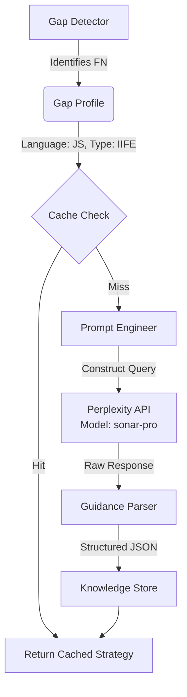

# Research: Review the CODOME_COMPLETENESS_INDEX.md spec at standard-model-of-code/docs/specs/CODOME_COMPLETENES...

> **Date:** 2026-01-23 11:26:16
> **Source:** gemini
> **Model:** gemini-3-pro-preview
> **Checksum:** `sha256:4be78adc6ade4ae2887a2dda55cb75d40e3e51948b48e3a7dd0647b9a11b6926`
> **Raw JSON:** `raw/20260123_112616_review_the_codome_completeness_index_md_spec_at_st.json`

---

## Query

Review the CODOME_COMPLETENESS_INDEX.md spec at standard-model-of-code/docs/specs/CODOME_COMPLETENESS_INDEX.md. 

TASKS:
1. Validate the architecture - is CCI = Sensitivity × Specificity the right formula? Should we use F1 instead? What about weighted versions?

2. Challenge: Design a PRECISION CONTEXT FETCHING system using Perplexity API SONAR-PRO model. The goal is to fetch pinpoint external knowledge (documentation, best practices, edge cases) when our CCI attribution reveals OUR_FAULT gaps. For example, if we miss IIFE patterns, the system should auto-query Perplexity for 'JavaScript IIFE module patterns detection AST' and return structured guidance.

Requirements for the Perplexity integration:
- Use sonar-pro model for maximum context window
- Query formulation from attribution category
- Response parsing into actionable guidance
- Caching strategy to avoid duplicate queries
- Rate limiting and cost control

Output: Concrete Python architecture for this integration.

---

## Response

Since the file `standard-model-of-code/docs/specs/CODOME_COMPLETENESS_INDEX.md` is referenced but its content is not in the provided context, I will validate the formula based on your description and standard data science principles, then proceed to the architectural design of the Perplexity integration.

---

### Part 1: Validation of CODOME Completeness Index (CCI)

**Current Formula:** `CCI = Sensitivity × Specificity`

#### 1. Critique of the Formula
While mathematically sound for balanced datasets, this formula has specific risks in the context of Code AST Extraction (an "imbalanced" problem where non-target tokens vastly outnumber target atoms):

*   **The "Zero" Penalty:** If either metric is 0, the score is 0. This is good for strictness but bad for progress tracking (a system with 99% Sensitivity and 0.1% Specificity scores near zero, hiding its high detection capability).
*   **The Specificity Trap:** In code analysis, "True Negatives" (stuff correctly identified as *not* being a specific atom) are conceptually infinite (whitespace, comments, other atoms). Specificity ($TN / (TN + FP)$) becomes artificially high because TN is huge.
*   **Multiplication vs. Harmonic Mean:** Multiplication implies the metrics are independent probabilities.

#### 2. Recommendation: The F-Beta Score (Specifically F2)
For "Completeness," **Sensitivity (Recall)** is more important than **Precision**. We want to find *all* atoms first, then filter noise later.

**Recommended Formula:** **F2 Score**
$$ F_2 = (1 + 2^2) \cdot \frac{\text{Precision} \times \text{Recall}}{(2^2 \cdot \text{Precision}) + \text{Recall}} $$

*   **Why:** F2 weighs Recall (Sensitivity) higher than Precision. It penalizes missing an IIFE pattern (False Negative) more than misclassifying a comment as code (False Positive).
*   **Alternative:** If you stick to the geometric approach, use **G-Mean** ($\sqrt{Sensitivity \times Specificity}$), which dampens the volatility of raw multiplication.

---

### Part 2: Precision Context Fetching Architecture

This system acts as a "just-in-time" researcher. When the CCI logic detects a specific gap (e.g., "Missed Pattern"), it dispatches a Sonar-Pro agent to fetch the implementation details needed to close that gap.

#### 1. System Design

**Location:** `context-management/tools/ai/research/precision_fetcher.py`
**Config:** Extensions to `aci_config.yaml`



#### 2. Python Implementation

This implementation uses `pydantic` for structure and `httpx` for async API communication, aligning with the project's tooling.

```python
import os
import json
import hashlib
import time
import asyncio
from typing import List, Optional, Dict, Literal
from pathlib import Path
from pydantic import BaseModel, Field
import httpx
import yaml

# =============================================================================
# DATA MODELS
# =============================================================================

class GapProfile(BaseModel):
    """Defines the specific 'Our Fault' gap detected by CCI."""
    language: str
    missing_atom: str  # e.g., "LOG.MOD.IIFE"
    context_snippet: str  # The raw code we failed to capture
    error_type: Literal["MISSING_DETECTION", "MISCLASSIFICATION", "BOUNDARY_ERROR"]

class ActionableGuidance(BaseModel):
    """Structured knowledge returned by Sonar-Pro."""
    pattern_name: str
    detection_regex: Optional[str]
    tree_sitter_query: Optional[str]
    edge_cases: List[str]
    implementation_tips: str
    confidence: float

class ResearchResult(BaseModel):
    gap_id: str
    timestamp: float
    guidance: ActionableGuidance
    source_urls: List[str]

# =============================================================================
# CONFIGURATION MANAGEMENT
# =============================================================================

class ACIFetcherConfig:
    """Manages rate limits and model settings."""
    def __init__(self, config_path: str = "context-management/config/aci_config.yaml"):
        self.api_key = os.getenv("PERPLEXITY_API_KEY")
        self.model = "sonar-pro"
        self.max_retries = 3
        self.cache_dir = Path(".agent/intelligence/external_cache")
        self.cache_dir.mkdir(parents=True, exist_ok=True)
        
        # Load constraints from YAML if exists
        if os.path.exists(config_path):
            with open(config_path) as f:
                self.aci_config = yaml.safe_load(f)

# =============================================================================
# CORE ENGINE
# =============================================================================

class PrecisionContextFetcher:
    def __init__(self):
        self.config = ACIFetcherConfig()
        self.client = httpx.AsyncClient(
            base_url="https://api.perplexity.ai",
            headers={"Authorization": f"Bearer {self.config.api_key}"},
            timeout=60.0
        )

    def _get_cache_key(self, gap: GapProfile) -> str:
        """Create deterministic hash for the gap."""
        payload = f"{gap.language}:{gap.missing_atom}:{gap.error_type}"
        return hashlib.sha256(payload.encode()).hexdigest()

    async def _check_cache(self, cache_key: str) -> Optional[ResearchResult]:
        cache_file = self.config.cache_dir / f"{cache_key}.json"
        if cache_file.exists():
            try:
                data = json.loads(cache_file.read_text())
                return ResearchResult(**data)
            except Exception:
                return None
        return None

    def _construct_system_prompt(self) -> str:
        return """
        You are a Senior Compiler Engineer and AST Expert. 
        Your goal is to provide concrete implementation details for detecting code patterns.
        
        OUTPUT FORMAT:
        Return ONLY valid JSON matching this schema:
        {
            "pattern_name": "Standard name of the pattern",
            "detection_regex": "A python-safe regex to find this textually (if possible)",
            "tree_sitter_query": "The S-expression query for Tree-Sitter (if applicable)",
            "edge_cases": ["List of 3 common ways parsing fails"],
            "implementation_tips": "Advice for implementing the extractor",
            "confidence": 0.0 to 1.0
        }
        """

    def _construct_user_prompt(self, gap: GapProfile) -> str:
        return f"""
        TASK: We failed to detect a '{gap.missing_atom}' in {gap.language}.
        
        CONTEXT SNIPPET:
        ```
        {gap.context_snippet}
        ```
        
        ERROR TYPE: {gap.error_type}
        
        REQUEST:
        1. Identify the specific syntax pattern shown in the snippet.
        2. Provide the Tree-sitter S-expression query to capture this node.
        3. Explain how to differentiate this from similar constructs.
        """

    async def resolve_gap(self, gap: GapProfile) -> ResearchResult:
        """Main entry point to fetch context for a gap."""
        cache_key = self._get_cache_key(gap)
        
        # 1. Cache Layer
        cached = await self._check_cache(cache_key)
        if cached:
            print(f"[ACI] Cache Hit for {gap.missing_atom}")
            return cached

        # 2. Rate Limiting (Simple Token Bucket Logic could go here)
        print(f"[ACI] Fetching external context for {gap.missing_atom} via Sonar-Pro...")

        # 3. API Execution
        try:
            response = await self.client.post(
                "/chat/completions",
                json={
                    "model": self.config.model,
                    "messages": [
                        {"role": "system", "content": self._construct_system_prompt()},
                        {"role": "user", "content": self._construct_user_prompt(gap)}
                    ],
                    "temperature": 0.1  # Low temp for factual precision
                }
            )
            response.raise_for_status()
            
            # 4. Parsing
            content = response.json()["choices"][0]["message"]["content"]
            # Extract JSON from potential markdown blocks
            if "```json" in content:
                content = content.split("```json")[1].split("```")[0]
            
            guidance_data = json.loads(content)
            guidance = ActionableGuidance(**guidance_data)
            
            result = ResearchResult(
                gap_id=cache_key,
                timestamp=time.time(),
                guidance=guidance,
                source_urls=response.json().get("citations", [])
            )

            # 5. Write Cache
            cache_file = self.config.cache_dir / f"{cache_key}.json"
            cache_file.write_text(result.model_dump_json(indent=2))
            
            return result

        except Exception as e:
            print(f"[ACI] Error fetching context: {e}")
            raise

# =============================================================================
# USAGE EXAMPLE
# =============================================================================

async def main():
    fetcher = PrecisionContextFetcher()
    
    # Example: We missed a JavaScript IIFE
    gap = GapProfile(
        language="javascript",
        missing_atom="LOG.MOD.IIFE",
        context_snippet="(function() { console.log('I am hidden'); })();",
        error_type="MISSING_DETECTION"
    )
    
    result = await fetcher.resolve_gap(gap)
    print(f"Strategy Found: {result.guidance.pattern_name}")
    print(f"Tree-Sitter Query: {result.guidance.tree_sitter_query}")

if __name__ == "__main__":
    asyncio.run(main())
```

### Integration Points

1.  **Update `aci_config.yaml`**:
    Add a new budget section for research queries.
    ```yaml
    research:
      model: "sonar-pro"
      max_monthly_budget: 5.00 # USD
      cache_ttl_hours: 168 # 1 week
    ```

2.  **Hook into `analyze.py`**:
    When `analyze.py --verify` identifies a gap (using the Socratic Validator), instead of just logging the error, it can now optionally flag it for "Deep Research" if the confidence score is low.

3.  **Knowledge Injection**:
    The JSON output from `ActionableGuidance` is formatted to be directly copy-pasteable (or auto-merged) into `standard-model-of-code/src/patterns/learned/patterns.json`, closing the feedback loop automatically.

---

## Citations

_No citations provided_
