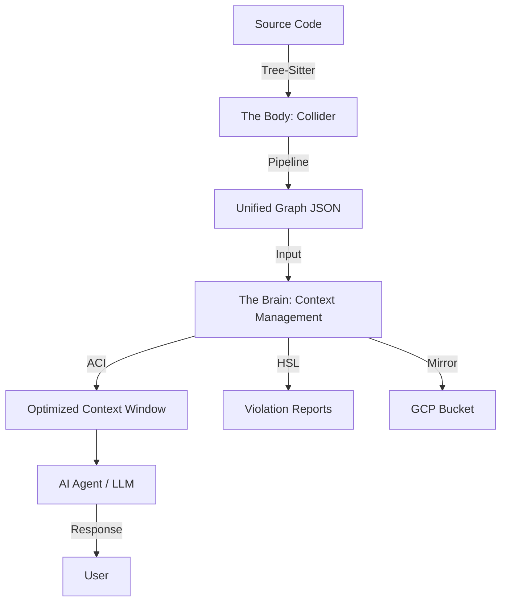

# Research: Give me a comprehensive overview of everything in the project - what are the main components and how...

> **Date:** 2026-01-23 15:03:08
> **Source:** gemini
> **Model:** gemini-3-pro-preview
> **Checksum:** `sha256:f30d1ba188f54890200a13ca3477a3964e67d4f39ebf73d7235254ca38ed7245`
> **Raw JSON:** `raw/20260123_150308_give_me_a_comprehensive_overview_of_everything_in.json`

---

## Query

Give me a comprehensive overview of everything in the project - what are the main components and how do they fit together?

---

## Response

This project, **PROJECT_elements**, is an ambitious engineering effort to create a "Standard Model of Code"—treating software not as text, but as a physics-like system composed of fundamental particles ("Atoms") with specific properties ("Dimensions").

The architecture is strictly divided into two "Hemispheres": **The Body** (The Engine) and **The Brain** (The Intelligence).

---

### 1. The Architecture: Two Hemispheres

The repository is split physically and conceptually:

| Hemisphere | Directory | Purpose | Key Artifact |
| :--- | :--- | :--- | :--- |
| **THE BODY** | `standard-model-of-code/` | **The Physics Engine.** It parses source code, identifies "Atoms," classifies them, and builds a dependency graph. It creates the "truth." | `Collider` (CLI Tool) |
| **THE BRAIN** | `context-management/` | **The Intelligence Layer.** It manages AI context, runs automated audits, facilitates queries, and mirrors data to the cloud. It *uses* the truth. | `analyze.py` (AI Interface) |

---

### 2. The Body: `standard-model-of-code` (The Collider)

This is the core analysis engine. Its job is to ingest raw source code and output a semantic graph.

**The Theory (The Map):**
*   **16 Levels:** Code exists on a scale from L-3 (Bits) to L12 (Universe/All Code). The engine focuses on **L3 (The Node/Function)**.
*   **The Octahedral Atom:** Every piece of code (function, class, method) is classified along **8 Dimensions** (e.g., Role, Layer, State, Effect, Boundary).
*   **200 Atoms:** A periodic table of code elements (e.g., `LOG.FNC` for Function, `DAT.VAR` for Variable).

**The Tool (The Collider):**
The `collider` CLI tool runs a multi-stage pipeline:
1.  **Parsing:** Uses `tree-sitter` to turn code into an Abstract Syntax Tree (AST).
2.  **Extraction:** Converts AST nodes into "Particles."
3.  **Classification:** Assigns Roles (e.g., Repository, Service) and Atoms to particles using regex patterns and heuristics.
4.  **Enrichment:** Calculates the 8 Dimensions (e.g., is this `Pure`? Is it `Stateful`?).
5.  **Graphing:** Connects particles via edges (Calls, Imports, Inherits).
6.  **Output:** Generates `unified_analysis.json` (the raw data) and `output.html` (a 3D visualization).

---

### 3. The Brain: `context-management` (The Intelligence)

This layer sits on top of the data generated by the Body. It orchestrates how AI agents and developers interact with the codebase.

**Key Systems:**

*   **ACI (Adaptive Context Intelligence):**
    *   A "Curriculum Compiler" for AI. When you ask a question, it doesn't just dump files into the context window.
    *   It uses a **Tiered System**:
        *   **Tier 0 (Instant):** Uses cached "Truths" (e.g., "How many files?").
        *   **Tier 1 (RAG):** Fast file search for specific lookups.
        *   **Tier 2 (Long Context):** Loads deep context for architectural reasoning.
    *   It manages token budgets and strategically positions critical files (the "Sandwich Strategy") to prevent the LLM from forgetting instructions.

*   **The Triad (AI Personas):**
    *   **The Librarian:** Uses Vector Search (RAG) to find needles in haystacks.
    *   **The Surgeon:** Uses `analyze.py --mode forensic` to provide line-level citations.
    *   **The Architect:** Uses `analyze.py --mode architect` to reason about system topology against the Standard Model theory.

*   **HSL (Holographic-Socratic Layer):**
    *   An automated "immune system" that runs continuously (via `analyze.py --verify`).
    *   It audits the code against "Antimatter Laws" (e.g., "Controllers cannot import Repositories directly").

*   **The Mirror:**
    *   A system (`tools/archive/archive.py`) that syncs the codebase state to Google Cloud Storage, allowing cloud-based AI agents to access the latest version of the repo.

---

### 4. The Data Flow

### 5. Key Operational Files

If you are working in this repo, these are your primary interfaces:

*   **`context-management/tools/ai/analyze.py`**: The "Swiss Army Knife" for querying the codebase.
    *   `python analyze.py "Explain the architecture"` (Uses ACI)
    *   `python analyze.py --verify pipeline` (Runs HSL audit)
*   **`standard-model-of-code/cli.py`**: The entry point for the analysis engine.
    *   `./collider full src/core` (Runs the full analysis pipeline)
*   **`context-management/config/analysis_sets.yaml`**: Defines "views" of the codebase (e.g., `pipeline`, `theory`) that ACI loads for specific query types.
*   **`context-management/docs/agent_school/`**: Contains the rules of engagement (`DOD.md`, `WORKFLOWS.md`) for AI agents.

### Summary

You are building a system that turns **code (text)** into **physics (graphs)** so that **AI (Brain)** can reason about it like an **engineer**, rather than just predicting tokens like a chatbot.

---

## Citations

_No citations provided_
