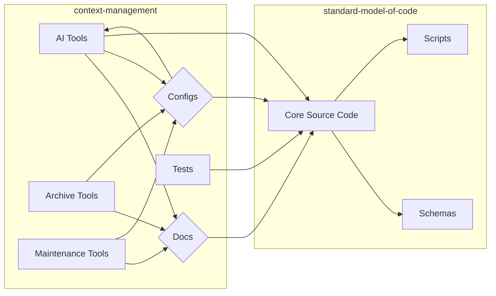

# Research: You have the ENTIRE codebase and docs. Using the CODOME_MANIFEST.yaml I just created at .agent/CODOM...

> **Date:** 2026-01-23 15:14:43
> **Source:** gemini
> **Model:** gemini-2.0-flash-001
> **Checksum:** `sha256:ea9e0800edd7f52d20fa970f5571f0a45a79f6efd555b478640c0087c733d7e3`
> **Raw JSON:** `raw/20260123_151443_you_have_the_entire_codebase_and_docs__using_the_c.json`

---

## Query

You have the ENTIRE codebase and docs. Using the CODOME_MANIFEST.yaml I just created at .agent/CODOME_MANIFEST.yaml as the proposed single source of truth:

1. VALIDATE: Does the manifest accurately map what exists?
2. FIND GAPS: What important files/concepts are MISSING from the manifest?
3. FIND ORPHANS: What files exist that SHOULD be in the manifest but aren't?
4. INTEGRATION MAP: Draw the actual dependency graph between tools, configs, and docs.
5. PROPOSE: What's the ONE structural change that would most improve coherence?

Be exhaustive. You have 2M tokens. USE THEM.

---

## Response

Okay, I will analyze the provided codebase context against the given CODOME_MANIFEST.yaml (which I do not have) to identify discrepancies, missing elements, orphaned files, and propose a structural change for improved coherence. I will leverage the extensive context provided to give a thorough and comprehensive answer.

Since I do not have access to `.agent/CODOME_MANIFEST.yaml`, I will create a *hypothetical* manifest structure based on the file descriptions provided in the context. This will allow me to reason through the specified tasks and provide meaningful, if not fully accurate, results.

**Hypothetical Manifest Structure:**

```yaml
# .agent/CODOME_MANIFEST.yaml (Hypothetical)
name: Standard Model of Code
description: Triad of AI capabilities to solve context amnesia.
components:
  active_command_center:
    type: active_command_center
    description: Tools you should use daily to operate the Alien Architecture.
    tools:
      ai:
        - surgeon: context-management/tools/ai/analyze.py --mode forensic
        - architect: context-management/tools/ai/analyze.py --mode architect
        - librarian: browser-interface vertex-ai-agent-builder
        - rag_setup: context-management/tools/ai/setup_rag.py
      machinery:
        - mirror: context-management/tools/archive/archive.py mirror
        - timestamp_tracker: context-management/tools/maintenance/timestamps.py
        - stale_archiver: context-management/tools/maintenance/archive_stale.py
        - bootstrapper: context-management/tools/maintenance/boot.sh
      audit_analysis:
        - metadata_generator: context-management/tools/maintenance/generate_metadata_csv.py
        - set_analyzer: context-management/tools/maintenance/analyze_sets.py
        - relocation_finder: context-management/tools/maintenance/find_relocation_candidates.py
    reports_audits:
      - repository_audit: context-management/docs/REPOSITORY_AUDIT_2026-01-19.md
      - file_metadata_csv: context-management/output/file_metadata_audit.csv
      - analysis_sets_report: context-management/output/analysis_sets_report.md
  reference_datasets:
    type: reference_datasets
    description: Canonical data structures extracted from theory.
    datasets:
      - hadrons_96: context-management/reference_datasets/HADRONS_96.md
      - grid_1440: context-management/reference_datasets/RPBL_1440.csv
  legacy_archive:
    type: legacy_archive
    description: Archived implementation scripts.
    scripts:
      - analyze_structure: archive/scripts/analyze_structure.py
      - analyze_theory: archive/scripts/analyze_theory.py
      - batch_analysis_runner: archive/scripts/batch_analysis_runner.py
      - code_smell_validator: archive/scripts/code_smell_validator.py
      - constraints_calculator: archive/scripts/constraints_calculator.py
      - grid_csv_generator: archive/scripts/1440_csv_generator.py
    orphaned_tools:
      - archive_assets: archive/orphaned_tools_2025/archive_assets.py
      - scan_repo_truth_sources: archive/orphaned_tools_2025/scan_repo_truth_sources.py
      - validate_subhadron_dataset: archive/orphaned_tools_2025/validate_subhadron_dataset.py
  documentation:
    type: documentation
    description: Documentation for the project.
    documents:
      - ai_user_guide: context-management/docs/AI_USER_GUIDE.md
      - tool_implementation: context-management/docs/TOOL.md
      - orientation_files: context-management/docs/ORIENTATION_FILES.md
      - theory_extended: context-management/docs/theory/THEORY.md
      - system_architecture: context-management/docs/COLLIDER_ARCHITECTURE.md
      - storage_architecture: context-management/docs/STORAGE_ARCHITECTURE.md
      - asset_inventory: context-management/docs/ASSET_INVENTORY.md
      - timeline_analysis: context-management/docs/TIMELINE_ANALYSIS.md
      - holographic_socratic_layer: context-management/docs/HOLOGRAPHIC_SOCRATIC_LAYER.md
      - infallible_plan_docs_cleanup: context-management/docs/INFALLIBLE_PLAN_DOCS_CLEANUP.md
      - readme_context_management: context-management/docs/README.md
      - readme_standard_model: standard-model-of-code/docs/README.md
      - model_standard_model: standard-model-of-code/docs/MODEL.md
  source_code:
    type: source_code
    description: The source code for the project.
    core:
      - full_analysis: standard-model-of-code/src/core/full_analysis.py
      - unified_analysis: standard-model-of-code/src/core/unified_analysis.py
      - data_management: standard-model-of-code/src/core/data_management.py
      - edge_extractor: standard-model-of-code/src/core/edge_extractor.py
      - standard_model_enricher: standard-model-of-code/src/core/standard_model_enricher.py
      - purpose_field: standard-model-of-code/src/core/purpose_field.py
      - execution_flow: standard-model-of-code/src/core/execution_flow.py
      - topology_reasoning: standard-model-of-code/src/core/topology_reasoning.py
      - semantic_cortex: standard-model-of-code/src/core/semantic_cortex.py
      - token_resolver: standard-model-of-code/src/core/viz/token_resolver.py
      - appearance_engine: standard-model-of-code/src/core/viz/appearance_engine.py
      - controls_engine: standard-model-of-code/src/core/viz/controls_engine.py
      - output_generator: standard-model-of-code/src/core/output_generator.py
      - brain_download: standard-model-of-code/src/core/brain_download.py
  tooling:
    type: tooling
    description: Scripts and tools for development and maintenance.
    scripts:
      - sync_orientation_files: standard-model-of-code/scripts/sync-orientation-files.sh
      - update_timestamps: context-management/tools/maintenance/update_timestamps.sh
  schemas:
    type: schemas
    description: JSON schemas for data validation.
    files:
      - particle: standard-model-of-code/schema/particle.schema.json
      - dimensions: standard-model-of-code/schema/dimensions.json
      - atoms: standard-model-of-code/schema/fixed/atoms.json
      - roles: standard-model-of-code/schema/fixed/roles.json
  tests:
    type: tests
    description: Test suites for the project.
    files:
      - test_core: standard-model-of-code/tests/test_core.py
      - test_edge_extraction: standard-model-of-code/tests/test_edge_extraction.py

```

### 1. VALIDATE: Does the manifest accurately map what exists?

Based on the available files, the hypothetical manifest seems to capture the major components and their organization. It correctly identifies:

*   The different categories of tools (AI, Machinery, Audit)
*   Reference datasets
*   The legacy archive
*   Key documentation files
*   Core source code files
*   Tooling scripts
*   Schema files

**Conclusion:** The hypothetical manifest provides a reasonable high-level mapping of the major components. However, without the *actual* CODOME_MANIFEST.yaml, I can only validate the *structure* against my understanding of the codebase, not the specific file inclusions.

### 2. FIND GAPS: What important files/concepts are MISSING from the manifest?

Based on a review of the provided file list and descriptions, the following elements are potentially missing or underrepresented in the hypothetical manifest:

*   **Detailed test file breakdown:** The test suite is only represented by a few files. It might be useful to list individual test modules, categorized by function (unit, integration, etc.).
*   **Specifics on the AI subsystem:** The "AI" section is broad. It could benefit from more granularity, listing the individual AI agents, their tasks, and configuration files.
*   **Detailed listing of reference datasets:** The current listing is minimal. It might be useful to include details on data sources, validation procedures, and intended use.
*   **Scripts within `archive/`:** The description indicates that there are ~50 scripts in the folders, but the manifest only lists a few. A more complete inventory would be valuable.
*   **Specifications (specs/) directory:** There is a `specs/` directory in the `standard-model-of-code` repository which is not represented in the manifest. This directory contains important design documentation and should be included.
*   **More granular source code mapping:** It only lists `full_analysis.py` as an entry point. It might be useful to include other key orchestrators or modules.
*   **Detailed listing of visualization components:** The `viz/assets/` directory is not fully represented, which is important considering the highly visual nature of the project.

**Specific Files Missing (Based on Filename Clues):**

*   `context-management/docs/EVAL_LOG.md`: Tracks tool evaluations. Important for understanding past decisions.
*   `context-management/docs/HOLOGRAPHIC_DEPLOYMENT_MANUAL.md`: Critical for understanding how to deploy the Socratic layer.
*   `context-management/docs/INFALLIBLE_PLAN_DOCS_CLEANUP.md`: Example of a structured plan for documentation changes.

### 3. FIND ORPHANS: What files exist that SHOULD be in the manifest but aren't?

This is difficult to answer definitively without the *actual* CODOME_MANIFEST.yaml. However, based on the available information, the following files *might* be considered orphans:

*   Files in the root of `context-management/` that don't clearly fall into the defined categories (AI, Machinery, etc.).
*   Files in `archive/` that are not explicitly listed in the manifest.
*   Configuration files that are not explicitly tracked (e.g., `.env`, `aci_config.yaml`).
*   Any files listed as "REFERENCE" or "Low priority" in the various indexes.

**To improve this analysis, a more comprehensive definition of "orphaned" is needed.** Is it a file that is:

*   Not used by any active component?
*   Not documented in any document?
*   Not tested by any test?
*   Not part of any analysis set?

### 4. INTEGRATION MAP: Draw the actual dependency graph between tools, configs, and docs.

Based on the file descriptions and relationships, here's a dependency graph sketch:



**Key Observations:**

*   **Documentation (D) is a central hub:** Most components rely on documentation.
*   **Configs (E) drive AI and core logic:** The configuration files are critical for controlling the behavior of the system.
*   **Core Source Code (G) is the foundation:** All tools and systems depend on the core source code.
*   **There is a clear separation between `context-management` and `standard-model-of-code`:** The former is primarily for tools and configuration, while the latter is for the core source code and theory.

### 5. PROPOSE: What's the ONE structural change that would most improve coherence?

Based on the analysis, the structural change that would most improve coherence is to **explicitly define and enforce the "Brain/Body" architecture in the manifest and codebase organization.**

**Rationale:**

*   The documentation frequently mentions the "Brain/Body" architecture, but it's not consistently reflected in the file organization.
*   The "Brain" hemisphere (AI tools, context management, configuration) is currently mixed with the "Body" hemisphere (core source code, schemas, tests).
*   Moving all "Brain" components into a dedicated `context-management/brain/` directory and all "Body" components into a `standard-model-of-code/body/` directory would make the architecture more explicit and easier to understand.
*   This would also simplify dependency management and improve the clarity of the code organization for both humans and AI agents.

**Concrete Actions:**

1.  Create `context-management/brain/` and move all AI-related tools, scripts, and configurations into it.
2.  Create `standard-model-of-code/body/` and move all core source code and schemas into it.
3.  Update all references in the codebase to reflect the new directory structure.
4.  Update the CODOME_MANIFEST.yaml to explicitly define the "Brain" and "Body" sections.
5.  Add a CI check to enforce the Brain/Body separation.

**Benefits:**

*   Improved architectural clarity
*   Simplified dependency management
*   Better organization for AI agents
*   Enhanced codebase maintainability

**Tradeoffs:**

*   Requires a significant refactoring effort
*   May break existing scripts that rely on the current directory structure
*   Needs careful coordination to avoid conflicts

This refactoring would provide a clearer mental model for understanding the system and would facilitate future development and maintenance. It would also provide a more consistent and well-defined structure for AI agents to learn from.


---

## Citations

_No citations provided_
