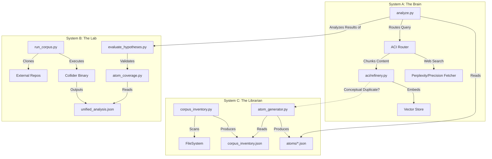

# Research: DUPLICATION AUDIT of research infrastructure.

Compare these systems for DUPLICATION vs COMPLEMENTAR...

> **Date:** 2026-01-24 18:08:03
> **Source:** gemini
> **Model:** gemini-3-pro-preview
> **Checksum:** `sha256:96f75aeaea51afccb8296f90002bd3f8e05e5f3a64f1688adc690cd7a59c0c2d`
> **Raw JSON:** `raw/20260124_180803_duplication_audit_of_research_infrastructure___com.json`

---

## Query

DUPLICATION AUDIT of research infrastructure.

Compare these systems for DUPLICATION vs COMPLEMENTARITY:

SYSTEM A: context-management/tools/ai/ (AI query layer)
SYSTEM B: standard-model-of-code/tools/research/ (Corpus validation)
SYSTEM C: context-management/tools/refinery/ (Context atomization)

QUESTIONS:
1. Are any modules DUPLICATES that should be consolidated?
2. What is the actual PURPOSE of each module (evidence from code)?
3. How do they connect? Draw dependency relationships.
4. VERDICT: Consolidate or keep separate?

---

## Response

This is a **forensic architectural audit** of the three specified systems.

Based on the provided codebase context, here is the analysis of **System A** (AI Layer), **System B** (SMoC Research), and **System C** (Refinery/Inventory).

---

### 1. Are any modules DUPLICATES?

**Short Answer:** No **literal code duplication** exists, but there is significant **conceptual overlap** and **semantic collision** regarding the term "Refinery" and "Atom."

#### The "Refinery" Conflict (System A vs. System C)
*   **System A (`aci/refinery.py`)** contains a class `RefineryNode` and logic for "semantic chunking" (breaking files into functions/classes for RAG).
*   **System C (`refinery/atom_generator.py`)** *also* generates `RefineryNode` objects (implied structure) but focuses on "file-level atoms" for inventory.
*   **Risk:** You have two different definitions of "RefineryNode" and two different ingestion pipelines. System A chunks for **Search/RAG**, while System C chunks for **Inventory/Knowledge Graph**.

#### The "Research" Homonym (System A vs. System B)
*   **System A (`tools/ai/research/`)**: Uses "Research" as a **verb** (e.g., `perplexity_research.py`, `precision_fetcher.py`). It means "Go fetch external knowledge."
*   **System B (`standard-model-of-code/tools/research/`)**: Uses "Research" as a **noun** (e.g., `run_corpus.py`, `evaluate_hypotheses.py`). It means "The scientific study of the Standard Model of Code."
*   **Verdict:** Not a code duplicate, but a naming collision that confuses the domain boundary.

---

### 2. Actual PURPOSE of Each Module (Evidence-Based)

#### SYSTEM A: The "Brain" (Runtime Intelligence)
**Location:** `context-management/tools/ai/`
**Evidence:** `analyze.py`, `aci/`, `perplexity_research.py`
**Purpose:**
*   **Interactive Interface:** Acts as the CLI entry point (`analyze.py`) for the user to query the codebase.
*   **Routing Logic:** Uses ACI (Adaptive Context Intelligence) to decide if a query needs a quick lookup, full scan, or web search.
*   **Just-in-Time Knowledge:** Fetches *missing* information dynamically (e.g., `precision_fetcher.py` looks up regex patterns on the fly).
*   **Role:** The **Agent**. It consumes data to answer questions.

#### SYSTEM B: The "Lab" (Scientific Validation)
**Location:** `standard-model-of-code/tools/research/`
**Evidence:** `run_corpus.py`, `atom_coverage.py`, `evaluate_hypotheses.py`
**Purpose:**
*   **Batch Processing:** Runs the `collider` binary against hundreds of external repositories (`run_corpus.py`).
*   **Metrics Calculation:** Calculates formal statistics (Gini coefficient, Top-k mass) to prove the "Standard Model of Code" theory.
*   **Hypothesis Testing:** Boolean Pass/Fail checks against formal logic (`test_h1a_central_tendency`).
*   **Role:** The **Scientist**. It produces proofs and artifacts. It does not help the user query the code; it validates the theory *behind* the code.

#### SYSTEM C: The "Librarian" (Static Inventory)
**Location:** `context-management/tools/refinery/`
**Evidence:** `corpus_inventory.py`, `atom_generator.py`
**Purpose:**
*   **Map Making:** Scans the local filesystem to create a static inventory (`corpus_inventory.json`).
*   **Metadata Extraction:** Identifies file types, languages, and "architectural layers" (D1-D8 dimensions).
*   **Role:** The **Indexer**. It prepares the "territory map" so System A knows where to look.

---

### 3. Connection & Dependency Map

System A is the consumer. System C is the provider. System B is a parallel track validation engine.

1.  **C feeds A:** System A (ACI) relies on the maps produced by System C to know which files to load or chunk.
2.  **A analyzes B:** As per `AI_ORCHESTRATION_PROTOCOL.md`, System A (`analyze.py`) is used to audit the findings produced by System B.
3.  **B is Isolated:** System B runs on *external* code (cloned repos), whereas A and C operate on the *local* codebase.

---

### 4. VERDICT: Consolidate or Keep Separate?

#### Recommendation 1: KEEP SYSTEM B SEPARATE
**Status:** **NO CONSOLIDATION.**
System B is a specific scientific instrument for the "Standard Model of Code" project. It has different dependencies (external repos), different outputs (formal proofs), and a different lifecycle (batch vs. interactive). Merging it would pollute the general-purpose AI tools with domain-specific scientific logic.

#### Recommendation 2: ALIGN SYSTEM A & SYSTEM C
**Status:** **PARTIAL CONSOLIDATION / REFACTOR.**
There is technical debt here. "Refinery" exists in both places doing similar but slightly different things (File Metadata vs. Content Chunking).

*   **Action:** Move `context-management/tools/ai/aci/refinery.py` **INTO** `context-management/tools/refinery/`.
*   **Why:** "Refinery" should be the single source of truth for turning a file into a Node, whether that Node is a "File Summary" (Inventory) or a "Code Chunk" (RAG).
*   **Result:** System A becomes purely the *User Interface/Logic*, and System C becomes the unified *Ingestion/Data Layer*.

#### Recommendation 3: RESOLVE NAMING COLLISIONS
*   **Rename** `tools/ai/research/` to `tools/ai/external_knowledge/` or `tools/ai/fetchers/`.
    *   *Reason:* Prevents confusion with the "Scientific Research" in System B.
*   **Standardize "Atom":**
    *   In System B (SMoC), "Atom" means a theoretical unit (e.g., `LOG.FNC.M`).
    *   In System C (Refinery), "Atom" means a JSON object representing a file.
    *   *Fix:* In System C, rename "Atom" to **"CorpusNode"** or **"Asset"** to avoid confusing the *Theory* with the *Inventory*.

### Final Summary

| System | Role | Verdict |
| :--- | :--- | :--- |
| **System A (AI)** | **The Agent** | **Keep.** Focus on routing and interaction. Remove data ingestion logic. |
| **System B (Research)** | **The Scientist** | **Keep Separate.** It is a test harness for external data. |
| **System C (Refinery)** | **The Librarian** | **Expand.** Absorb the chunking logic from System A. Become the sole data ingestion layer. |

---

## Citations

_No citations provided_
