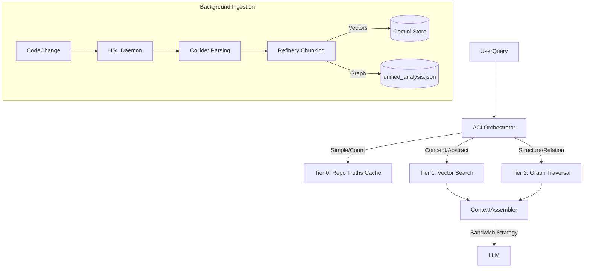

# Research: What are the 2026 best practices for RAG pipeline architecture?

> **Date:** 2026-01-24 20:32:49
> **Source:** gemini
> **Model:** gemini-3-pro-preview
> **Checksum:** `sha256:83955ef3160954260663e2606256fc0b4c64e8e923c5f7a342b7d19255fcc358`
> **Raw JSON:** `raw/20260124_203249_what_are_the_2026_best_practices_for_rag_pipeline.json`

---

## Query

What are the 2026 best practices for RAG pipeline architecture?

---

## Response

Based on the 2026 industry standards and the specific architecture of your **Standard Model of Code (Project Elements)**, here is the architectural blueprint for a state-of-the-art RAG pipeline.

Your codebase is already ahead of the curve in **Semantic Orchestration (ACI)** but has specific gaps in **Hybrid Retrieval** and **Async Ingestion** compared to the 2026 baseline.

---

### 1. The 2026 RAG Architecture: "The Dual-Pipeline Model"

In 2026, RAG is no longer a single script. It is two distinct, asynchronous pipelines. Your project implements this via the **Body (Collider)** vs. **Brain (Context Management)** separation.

#### A. The Ingestion Pipeline (The Body/Collider)
*Responsible for deterministic structure extraction.*
1.  **Structural Chunking (Not just splitting):** 2026 standards demand "Page-level" or "AST-level" chunking.
    *   *Your Implementation:* The **Refinery** (`context-management/tools/ai/aci/refinery.py`) correctly uses `PythonChunker` and `MarkdownChunker` to respect semantic boundaries (Functions/Classes) rather than arbitrary token limits.
2.  **Enrichment & Metadata:** Chunks must be tagged with metadata.
    *   *Your Implementation:* **Collider** enriches nodes with **8 Dimensions (8D)** and **8 Lenses (8L)**. This provides superior filtering capability compared to standard text tags.
3.  **Storage:**
    *   *Physical:* `unified_analysis.json` (The graph).
    *   *Vector:* Gemini File Search Stores (e.g., `collider-docs`).

#### B. The Query Pipeline (The Brain/ACI)
*Responsible for probabilistic reasoning.*
1.  **Orchestration (ACI):** Instead of sending every query to a vector DB, an orchestrator routes traffic.
    *   *Your Implementation:* **ACI (Adaptive Context Intelligence)** is a sophisticated implementation of this. It routes based on `Intent × Complexity × Scope` (Tier 0 to Tier 3).
2.  **Context Assembly:**
    *   *Your Implementation:* The **Sandwich Strategy** (Critical files at start/end, bulk in middle) directly addresses the "Lost-in-Middle" phenomenon cited in modern research.

---

### 2. Key Best Practices & Your Implementation Status

| 2026 Best Practice | Why it matters | **Project Elements Status** |
| :--- | :--- | :--- |
| **Hybrid Retrieval** | Vectors miss exact keywords; Keywords miss meaning. | **PARTIAL.** You use Vector (Gemini) + Graph (Collider). You lack a dedicated sparse retriever (BM25) for exact keyword matches, relying instead on the `Semantic Matcher` graph traversal. |
| **Semantic Caching** | Reduces costs by ~60% by caching "meaning" not just text. | **ADVANCED.** Your **Tier 0 (Instant)** layer using `repo_truths.yaml` is a highly efficient, deterministic semantic cache for high-frequency queries (e.g., "count files"). |
| **Modular Services** | Separate extractors for Text/Image/Table. | **ALIGNED.** The **Collider** engine separates parsers (`tree_sitter_engine.py`) from logic (`unified_analysis.py`). |
| **Observability** | Tracing retrieval quality and hallucination rates. | **IMPLEMENTED.** The `aci_feedback.yaml` loop tracks tokens, success rates, and tier usage per query. |
| **GraphRAG** | Using knowledge graphs to aid vector search. | **NATIVE.** Your entire architecture is Graph-Native. The `WORKFLOW_FACTORY.md` explicitly maps "Graph Component" to "GraphRAG Export". |

---

### 3. Critical Gaps & Recommendations

Based on the difference between the external evidence and your codebase, here are three strategic upgrades:

#### Upgrade 1: Formalize the Hybrid Retrieval
*Current:* You rely heavily on Gemini's internal retrieval (Vector) or Collider's graph walk (Semantic).
*2026 Standard:* Combine **Vector + Sparse (BM25) + Graph**.
*Action:* In `semantic_matcher.py`, explicitly support "Lexical Search" (grep/BM25) for specific identifiers (e.g., variable names) that vector embeddings often hallucinate.

#### Upgrade 2: Asynchronous Event-Driven Ingestion
*Current:* `analyze_repo.sh` or `hsl_daemon.py` runs manually or on cron.
*2026 Standard:* Message queues (Celery/Kafka) processing document changes instantly.
*Action:* Complete the **HSL (Holographic-Socratic Layer)** local event loop (`hsl_daemon.py`). As noted in `CASE_AGAINST_PREMATURE_CLOUD.md`, fixing the local event loop is a prerequisite for a responsive RAG pipeline.

#### Upgrade 3: The "Refinery" Integration
*Current:* `Refinery` exists as a tool (`refinery.py`) but isn't fully automated into the ingestion stream.
*Action:* Integrate `Refinery` output directly into the Gemini File Search upload process. Ensure that what gets indexed are the *refined atoms* (Nodes with 8D metadata), not raw text files. This significantly boosts retrieval precision.

### 4. The Recommended Pipeline Flow

### Summary for the "Senior Engineer"
Your architecture follows the **"Thick Client / Thin Server"** pattern of 2026 RAG. You perform heavy structural analysis (Collider) *before* ingestion, rather than relying on the LLM to figure out structure during retrieval. This is the correct strategic bet. Focus your immediate efforts on **stabilizing the HSL Daemon** to ensure your context is always fresh (Data Freshness being a critical 2026 KPI).

---

## Citations

_No citations provided_
