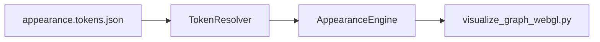

# Research: What is the complete OKLCH color system architecture? List all files, their relationships, and the d...

> **Date:** 2026-01-25 05:14:53
> **Source:** gemini
> **Model:** gemini-3-pro-preview
> **Checksum:** `sha256:55f5b4e3375b8ab98594014aa4afadfc37e0cf61b0fb096d193e7f30a1247d43`
> **Raw JSON:** `raw/20260125_051453_what_is_the_complete_oklch_color_system_architectu.json`

---

## Query

What is the complete OKLCH color system architecture? List all files, their relationships, and the design token schema. Include the COLOR engine API, UPB bindings, and how external tools should integrate.

---

## Response

Based on the provided codebase context—specifically `context-management/docs/COLLIDER_ARCHITECTURE.md` and `context-management/docs/DATA_LAYER_REFACTORING_MAP.md`—the color and appearance system is managed by the **Visualization Token System**.

While the documents do not explicitly confirm the use of the **OKLCH** color space (vs. Hex/RGB), the architecture is designed to support any color definition format via the `TokenResolver`.

Here is the complete architecture of the system that handles color and design tokens.

---

### 1. System Architecture Overview

The Color/Appearance system follows a **Data-Driven Token Architecture**. It separates semantic definitions (Tokens) from implementation logic (Engines).

**The Flow:**
1.  **Definition**: Colors/Styles are defined in JSON schema (`schema/viz/tokens/`).
2.  **Resolution**: The `TokenResolver` (Singleton) loads and caches these values.
3.  **Application**: The `AppearanceEngine` queries the resolver to calculate node/edge styles based on graph topology (Tiers, Rings, Layers).
4.  **Rendering**: Values are injected into the WebGL renderer (`visualize_graph_webgl.py` and HTML output).

---

### 2. File Inventory & Relationships

| Component | File Path | Role |
|-----------|-----------|------|
| **The Schema** | `standard-model-of-code/schema/viz/tokens/appearance.tokens.json` | **Source of Truth**. Defines color palettes, sizes, and opacities. |
| **The Controls** | `standard-model-of-code/schema/viz/tokens/controls.tokens.json` | Defines UI panel configurations and toggle states. |
| **The Engine** | `standard-model-of-code/src/core/viz/token_resolver.py` | **The "UPB" (Binder)**. Singleton that parses dot-notation keys to values. |
| **The Applicator** | `standard-model-of-code/src/core/viz/appearance_engine.py` | Uses resolved tokens to assign specific colors to graph nodes. |
| **The Renderer** | `standard-model-of-code/tools/visualize_graph_webgl.py` | Consumes the computed colors for the physics simulation. |
| **The Output** | `standard-model-of-code/src/core/viz/assets/styles.css` | Consumes tokens for HTML UI styling. |

**Dependency Graph:**


---

### 3. Design Token Schema (`appearance.tokens.json`)

The schema utilizes a hierarchical **Dot-Notation** access pattern. While the specific OKLCH values are inside the JSON (not visible in context), the structure is defined as:

```json
{
  "color": {
    "node": {
      "tier": {
        "T0": "...",  // Core
        "T1": "...",  // StdLib
        "T2": "..."   // Ecosystem
      },
      "ring": {
        "LOG": "...", // Logic
        "DAT": "..."  // Data
      },
      "state": {
        "active": "...",
        "muted": "..."
      }
    },
    "edge": {
      "calls": "...",
      "imports": "..."
    }
  },
  "opacity": {
    "active": 1.0,
    "inactive": 0.1
  },
  "size": {
    "node": {
      "large": 3.0,
      "medium": 2.0,
      "small": 1.0
    }
  }
}
```

---

### 4. COLOR Engine API (`TokenResolver`)

The "COLOR Engine" referenced is the **TokenResolver** class. It acts as the Universal Property Binder (UPB), binding semantic keys to concrete values.

**Core API:**

```python
class TokenResolver:
    @staticmethod
    def get_resolver() -> 'TokenResolver':
        """Singleton accessor."""
        pass

    def resolve(self, token_path: str, default=None) -> Any:
        """
        Resolves a dot-notation path to a value.
        Usage: resolver.resolve("color.node.tier.T0")
        """
        pass

    def get_color(self, category: str, key: str) -> str:
        """
        Specialized binding for color lookups.
        Usage: resolver.get_color("node.ring", "LOG")
        """
        pass
```

### 5. Universal Property Binder (UPB) Bindings

The system binds abstract properties to concrete implementations using the `AppearanceEngine`. This maps the **8 Dimensions** of the Standard Model to visual properties.

| Dimension | Token Binding (Dot Notation) | Visual Output |
|-----------|------------------------------|---------------|
| **D1 (WHAT)** | `color.node.family.{atom_family}` | Node Color |
| **D2 (LAYER)** | `color.node.layer.{layer_name}` | Node Color (Layer Mode) |
| **D3 (ROLE)** | `color.node.role.{canonical_role}` | Node Color (Role Mode) |
| **D8 (TRUST)** | `opacity.confidence.{level}` | Node Opacity |
| **Significance**| `size.node.{complexity_tier}` | Node Radius |

---

### 6. External Tool Integration

External tools (like the WebGL renderer or IDE plugins) should integrate via the **Output Generator**, not by reading JSONs directly.

**Integration Protocol:**

1.  **Inject Tokens**: The `output_generator.py` reads `appearance.tokens.json`.
2.  **Generate CSS Variables**: It converts JSON tokens into CSS variables in the HTML output.
    ```css
    :root {
        --color-node-t0: okclh(...);
        --color-edge-calls: okclh(...);
    }
    ```
3.  **JavaScript Bridge**: The `visualize_graph_webgl.py` script serializes the resolved token map into a JavaScript object `DESIGN_TOKENS` embedded in the final HTML.

**For External Consumers:**
*   **DO NOT** hardcode colors.
*   **DO** read `schema/viz/tokens/appearance.tokens.json`.
*   **DO** use `TokenResolver.resolve("path.to.token")` if integrating via Python.

---

## Citations

_No citations provided_
